# KaggleGo

Fall in Love with DeepSeek Hackathon Project

This is a project for the Fall in Love with DeepSeek Hackathon. The project is built using the Camel framework, which is a framework for building large language models.

## Installation

To run the project, you will need to have the following installed:

- Python 3.12
- Camel 0.2.19
- Kaggle
- Streamlit

You can install the required packages using the following commands:

```bash
pip install camel
pip install "camel-ai[all]==0.2.19"#for all the dependencies
pip install kaggle
pip install streamlit

```

## Usage

To run the project, use the following command:

```bash
streamlit run KaggleGo_app.py
```

## Demo Video

You can watch the demo video showcasing the features of KaggleGo below:

[Demo Video 1 Setup](demo-video/video1.mp4)

[Demo Video 2 RuningOutput](demo-video/demo_output2025-02-18%2013-38-43.mp4)


## Demo picture:
（to be updated）

Taggle the button `KaggleGo!` to start the demo.

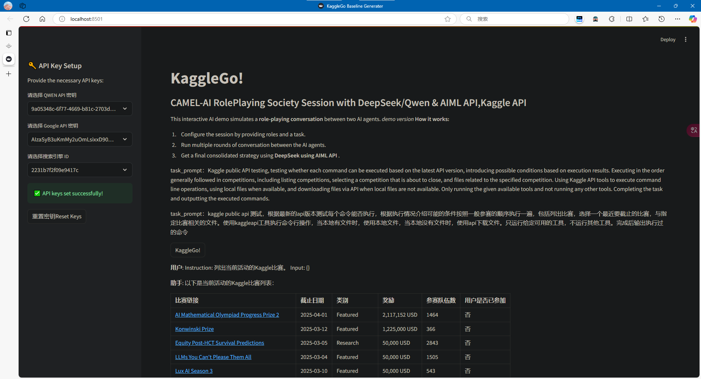
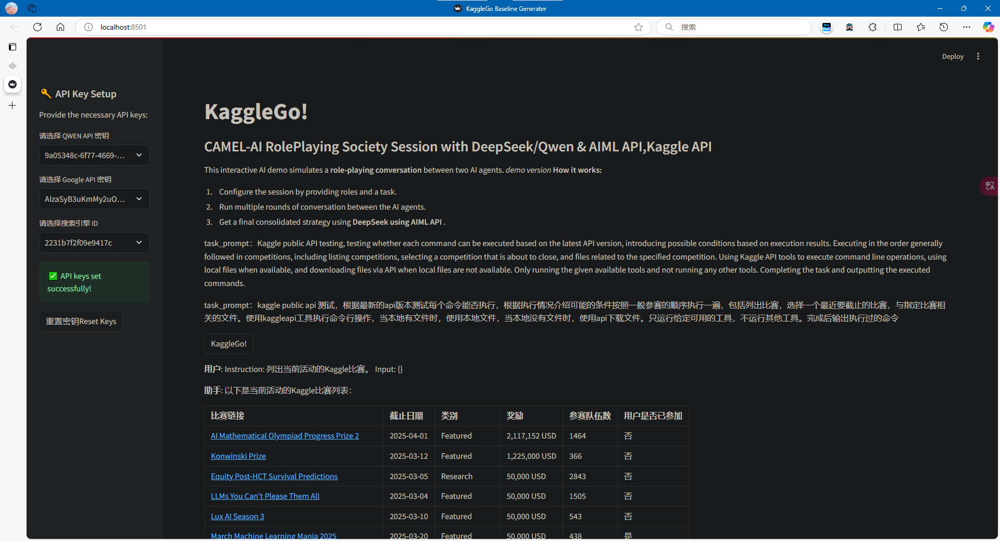

## Dev log

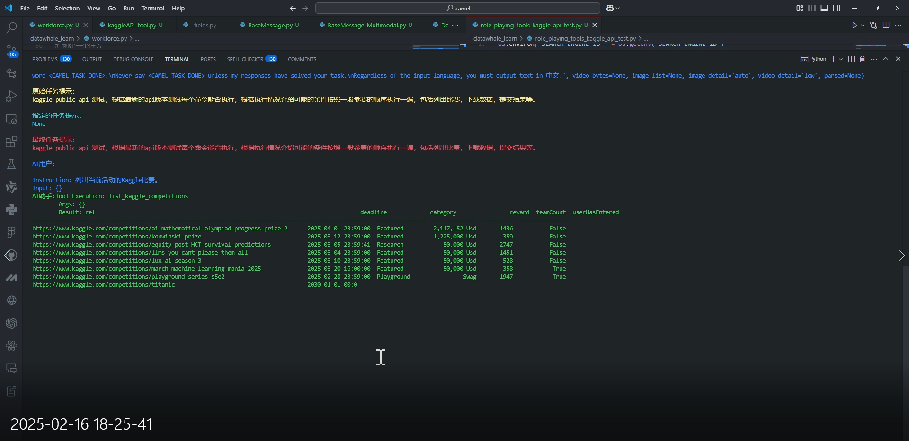
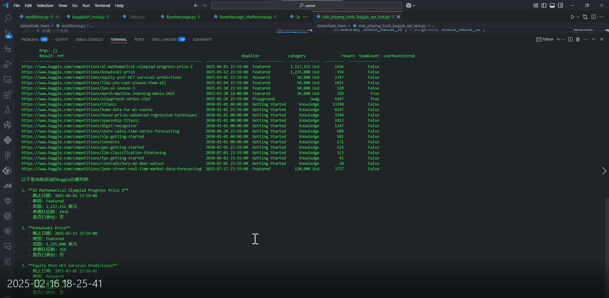
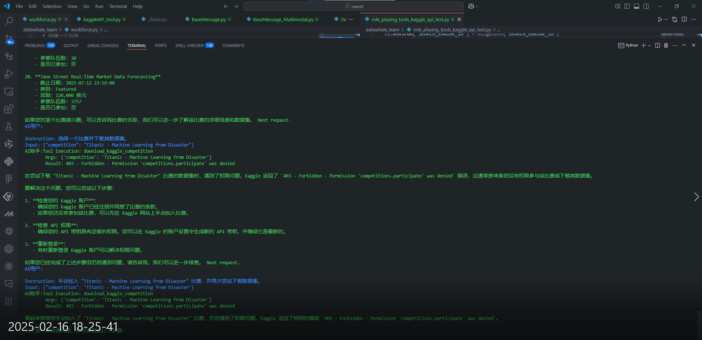
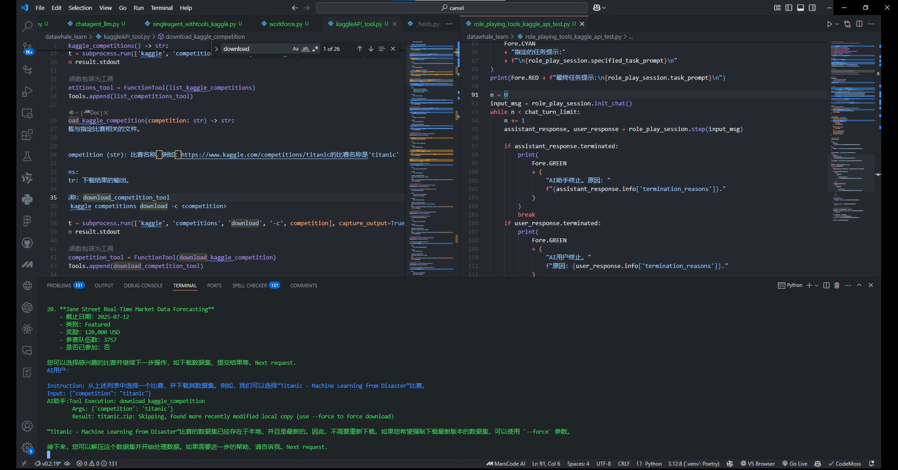
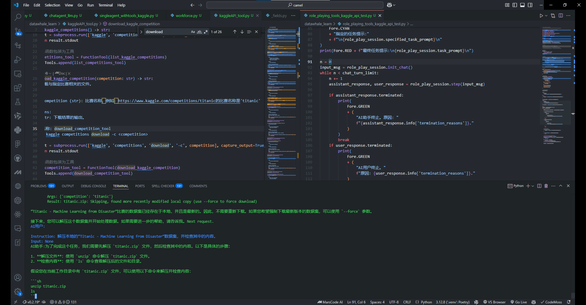

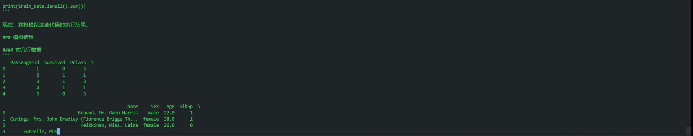
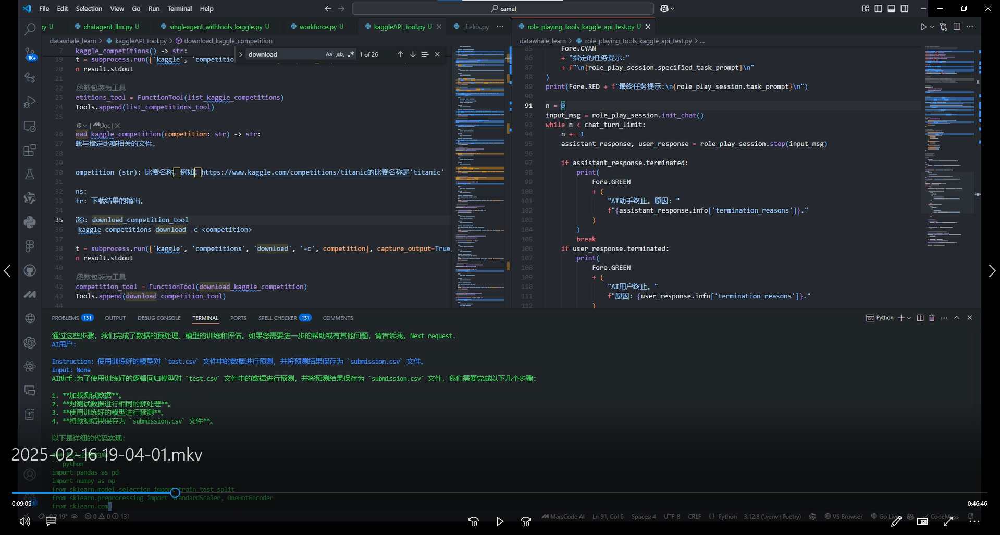
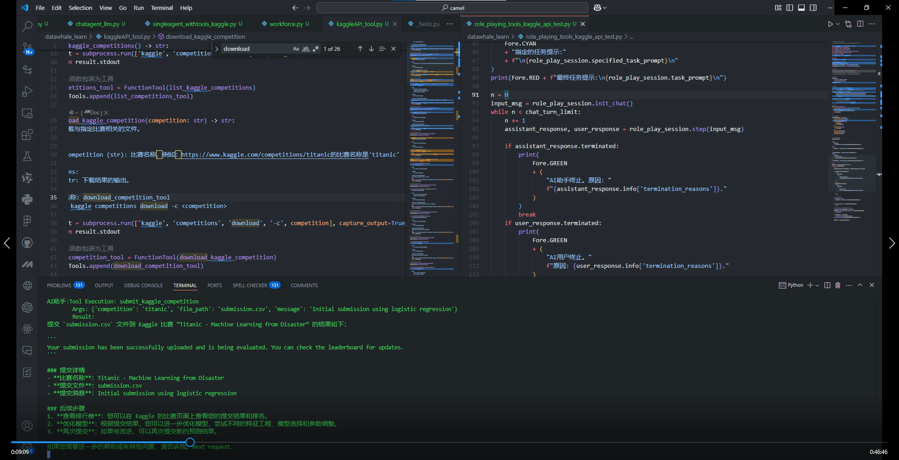
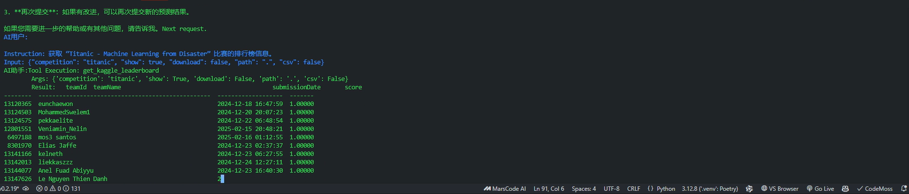

## Todo list

- [ ] 1. 使用critic_agent引入human用户协作 (Introduce human user collaboration using critic_agent)
- [ ] 2. 实现KaggleGo的核心功能，包括数据获取、数据清洗、数据预处理、模型训练、模型评估、模型部署等 (Implement core functionalities of KaggleGo, including data acquisition, data cleaning, data preprocessing, model training, model evaluation, and model deployment)
- [x] 3. 实现一个简单的streamlit app，用于展示KaggleGo的功能 (Create a simple Streamlit app to showcase the features of KaggleGo)

